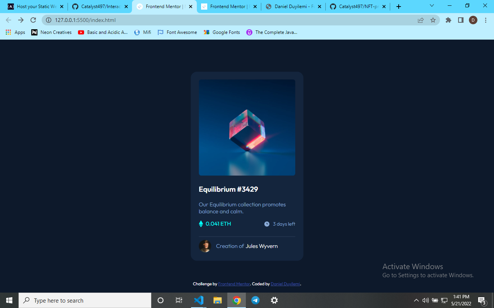

# Frontend Mentor - NFT preview card component solution

This is a solution to the [NFT preview card component challenge on Frontend Mentor](https://www.frontendmentor.io/challenges/nft-preview-card-component-SbdUL_w0U). Frontend Mentor challenges help you improve your coding skills by building realistic projects.

## Table of contents

- [Overview](#overview)
  - [The challenge](#the-challenge)
  - [Screenshot](#screenshot)
  - [Links](#links)
- [My process](#my-process)
  - [Built with](#built-with)
  - [What I learned](#what-i-learned)
  - [Continued development](#continued-development)
  - [Useful resources](#useful-resources)
- [Author](#author)
- [Acknowledgments](#acknowledgments)

### The challenge

Users should be able to:

- View the optimal layout depending on their device's screen size
- See hover states for interactive elements

### Screenshot

### Links

- Solution URL: [Add solution URL here](https://your-solution-url.com)
- Live Site URL: [Add live site URL here](https://your-live-site-url.com)

## My process

First! I structured my HTML to my convenince and also with the best practices I know of.
Next! I started with my CSS. Did the general stylings first (such as font-family, font-color[color], etc), moved to the specifics and just enjoyed myself with the entire process till I was done.

### Built with

- HTML5
- CSS3
- Flexbox

### What I learned

From this project I learned a few things about practicing:

1. You never actually know it until you've actually done it. This project caused me to take those those skills I thought I already knew and implement in a project.
2. Practicing is what really makes you a programmer. I have watched a bunch of videos on making use of the skills I used in this project and I've seen amazing things being done by using things like flexbox but when I began to write the code for this project, I realized what being a developer really is like. It is less of the theoretical stuff, more of the practical.

Those this project was really simple, it was some really good practice.

### Continued development

- Bootstrap
- Javascript
- React
- Node.js
- MySQL

## Author

- Website - [Daniel Duyilemi](https://vast-falls-30673.herokuapp.com/)
- Frontend Mentor - [@yourusername](https://www.frontendmentor.io/profile/Catalyst497)

## Acknowledgments

I would really like to thank frontmentor for this nice project.
